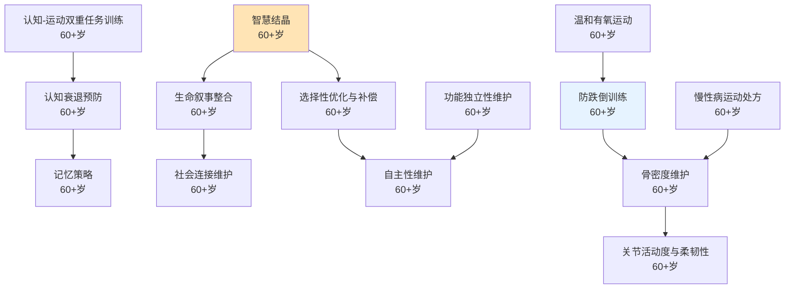

# 长者期（60+岁）

## 阶段概述

长者期是人生中智慧结晶、生命经验高度整合的阶段，也是认知衰退预防、生命叙事整合、社会连接维护的重要时期。此阶段的核心任务是运用一生积累的智慧指导后辈，维护身心健康，同时回顾人生、找到意义，实现生命的圆满和升华。

---

## 能力清单

### 认知与心理主线

| 能力 | 说明 | 关键期 | Prompt |
|------|------|--------|--------|
| 智慧结晶 | 生活经验的高度整合 | 60+岁 | [wisdom-crystallization-01](core/cognitive-psychological/wisdom-crystallization-01.md) |
| 选择性优化与补偿 | 聚焦重要之事，用策略弥补衰退 | 60+岁 | [selective-optimization-01](core/cognitive-psychological/selective-optimization-01.md) |
| 认知衰退预防 | 神经可塑性训练、认知刺激 | 60+岁 | [cognitive-decline-prevention-01](core/cognitive-psychological/cognitive-decline-prevention-01.md) |
| 记忆策略 | 外部辅助、编码策略 | 60+岁 | [memory-strategies-01](core/cognitive-psychological/memory-strategies-01.md) |
| 生命叙事整合 | 接纳过去，找到意义 | 60+岁 | [life-narrative-01](core/cognitive-psychological/life-narrative-01.md) |
| 社会连接维护 | 对抗孤独、维护社交网络 | 60+岁 | [social-connection-01](core/cognitive-psychological/social-connection-01.md) |
| 自主性维护 | 保持独立生活能力 | 60+岁 | [autonomy-maintenance-01](core/cognitive-psychological/autonomy-maintenance-01.md) |

### 身体能力主线

| 能力 | 说明 | 关键期 | Prompt |
|------|------|--------|--------|
| 防跌倒训练 | 平衡、力量、反应速度 | 60+岁 | [fall-prevention-01](core/physical/fall-prevention-01.md) |
| 骨密度维护 | 承重运动+抗阻训练 | 60+岁 | [bone-density-02](core/physical/bone-density-02.md) |
| 关节活动度与柔韧性 | 保持关节健康和活动能力 | 60+岁 | [joint-flexibility-01](core/physical/joint-flexibility-01.md) |
| 温和有氧运动 | 散步、太极、水中运动 | 60+岁 | [gentle-aerobic-01](core/physical/gentle-aerobic-01.md) |
| 认知-运动双重任务训练 | 运动同时进行认知挑战 | 60+岁 | [dual-task-training-01](core/physical/dual-task-training-01.md) |
| 慢性病运动处方 | 糖尿病、高血压、关节炎 | 60+岁 | [chronic-disease-exercise-01](core/physical/chronic-disease-exercise-01.md) |
| 功能独立性维护 | 日常活动能力保持 | 60+岁 | [functional-independence-01](core/physical/functional-independence-01.md) |

---

## 学习路径图

---

## 理论依据

- Erikson整合vs绝望（60+）
- Baltes SOC模型
- Butler生命回顾疗法
- 神经可塑性研究（Merzenich等）
- Carstensen社会情绪选择理论（优先情感有意义的关系）
- 认知储备理论（Stern）
- WHO老年人运动指南（2020）
- 跌倒预防循证干预（Cochrane系统综述）
- 太极拳防跌倒Meta分析
- 认知-运动双重任务训练研究
- Fried衰弱综合征表型标准