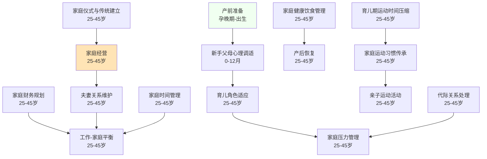

# 家庭期（25-45岁）

## 阶段概述

家庭期是人生中建立和经营家庭的关键阶段，也是育儿角色适应、夫妻关系维护、代际关系处理的重要时期。此阶段的核心任务是在家庭中建立稳定的关系，培养下一代，同时平衡工作与家庭，建立家庭的传统和价值观。

**特别说明**：本阶段包含**父母支持主线**，为新手父母提供系统化的育儿指导和心理支持。

---

## 能力清单

### 认知与心理主线

| 能力 | 说明 | 关键期 | Prompt |
|------|------|--------|--------|
| 家庭经营 | 亲密关系维护、家庭氛围营造 | 25-45岁 | [family-management-01](core/cognitive-psychological/family-management-01.md) |
| 育儿角色适应 | 从夫妻到父母的角色转变 | 25-45岁 | [parenting-role-01](core/cognitive-psychological/parenting-role-01.md) |
| 家庭压力管理 | 育儿压力、经济压力、代际冲突 | 25-45岁 | [family-stress-01](core/cognitive-psychological/family-stress-01.md) |
| 家庭财务规划 | 家庭预算、教育基金、保险规划 | 25-45岁 | [family-financial-01](core/cognitive-psychological/family-financial-01.md) |
| 代际关系处理 | 与父母、公婆的关系管理 | 25-45岁 | [intergenerational-01](core/cognitive-psychological/intergenerational-01.md) |
| 夫妻关系维护 | 婚姻经营、冲突解决、亲密感维持 | 25-45岁 | [marital-maintenance-01](core/cognitive-psychological/marital-maintenance-01.md) |
| 工作-家庭平衡 | 职业发展与家庭责任的平衡 | 25-45岁 | [work-family-balance-01](core/cognitive-psychological/work-family-balance-01.md) |
| 家庭仪式与传统建立 | 家庭文化的建立与传承 | 25-45岁 | [family-rituals-01](core/cognitive-psychological/family-rituals-01.md) |

### 身体能力主线

| 能力 | 说明 | 关键期 | Prompt |
|------|------|--------|--------|
| 家庭运动习惯传承 | 建立家庭运动文化 | 25-45岁 | [family-exercise-02](core/physical/family-exercise-02.md) |
| 亲子运动活动 | 适合亲子共同参与的运动 | 25-45岁 | [parent-child-exercise-01](core/physical/parent-child-exercise-01.md) |
| 家庭健康饮食管理 | 家庭营养、健康饮食习惯 | 25-45岁 | [family-nutrition-01](core/physical/family-nutrition-01.md) |
| 产后恢复 | 女性产后身体恢复 | 25-45岁 | [postpartum-recovery-01](core/physical/postpartum-recovery-01.md) |
| 家庭时间管理 | 家庭日程安排、时间分配 | 25-45岁 | [family-time-01](core/physical/family-time-01.md) |
| 育儿期运动时间压缩应对 | 育儿期间的运动时间管理 | 25-45岁 | [parenting-exercise-01](core/physical/parenting-exercise-01.md) |

### 父母支持主线

| 主题 | 说明 | 适用时期 | Prompt |
|------|------|---------|--------|
| 产前准备与迎接新生儿 | 心理、知识、夫妻关系、物品准备 | 孕晚期-出生 | [prenatal-preparation-01](core/parenting-support/prenatal-preparation-01.md) |
| 新手父母心理调适 | 产后情绪、睡眠剥夺、角色适应 | 0-12月 | [parental-wellbeing-01](core/parenting-support/parental-wellbeing-01.md) |

---

## 学习路径图

---

## 理论依据

- Erikson繁衍vs停滞
- 家庭系统理论（Bowen）
- 依恋理论代际传递
- Gottman夫妻关系研究
- 家庭韧性模型
- 家庭健康行为研究
- 亲子运动发展
- 产后运动康复指南
- 家庭健康促进模型