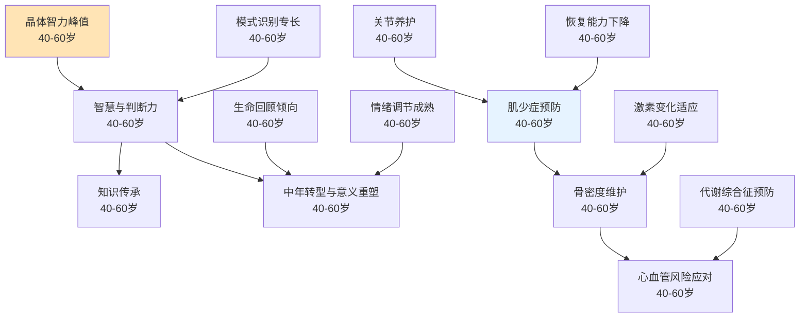

# 中年期（40-60岁）

## 阶段概述

中年期是人生中晶体智力达到峰值、智慧与判断力最为成熟的阶段，也是知识传承、中年转型、意义重塑的重要时期。此阶段的核心任务是运用积累的经验和智慧指导他人，应对身体机能的自然衰退，同时重新审视人生意义，实现生命的深化和升华。

---

## 能力清单

### 认知与心理主线

| 能力 | 说明 | 关键期 | Prompt |
|------|------|--------|--------|
| 晶体智力峰值 | 知识、经验、判断力最强时期 | 40-60岁 | [crystallized-intelligence-01](core/cognitive-psychological/crystallized-intelligence-01.md) |
| 模式识别专长 | 基于经验的快速判断能力 | 40-60岁 | [pattern-recognition-01](core/cognitive-psychological/pattern-recognition-01.md) |
| 智慧与判断力 | 从知识到智慧的转化 | 40-60岁 | [wisdom-judgment-01](core/cognitive-psychological/wisdom-judgment-01.md) |
| 知识传承 | mentor/教练角色、指导下一代 | 40-60岁 | [knowledge-transmission-01](core/cognitive-psychological/knowledge-transmission-01.md) |
| 生命回顾倾向 | 回顾人生、总结经验 | 40-60岁 | [life-review-01](core/cognitive-psychological/life-review-01.md) |
| 中年转型与意义重塑 | 重新审视人生目标和价值观 | 40-60岁 | [midlife-transition-01](core/cognitive-psychological/midlife-transition-01.md) |
| 情绪调节成熟 | 情绪管理的最高水平 | 40-60岁 | [emotional-regulation-mature-01](core/cognitive-psychological/emotional-regulation-mature-01.md) |

### 身体能力主线

| 能力 | 说明 | 关键期 | Prompt |
|------|------|--------|--------|
| 肌少症预防 | 40岁后肌肉量每10年约降8% | 40-60岁 | [sarcopenia-prevention-01](core/physical/sarcopenia-prevention-01.md) |
| 骨密度维护 | 尤其女性围绝经期加速流失 | 40-60岁 | [bone-density-01](core/physical/bone-density-01.md) |
| 心血管风险上升应对 | 心血管疾病风险增加 | 40-60岁 | [cardiovascular-risk-01](core/physical/cardiovascular-risk-01.md) |
| 关节养护与活动度维持 | 关节健康、活动度保持 | 40-60岁 | [joint-health-01](core/physical/joint-health-01.md) |
| 代谢综合征预防 | 胰岛素抵抗、腹型肥胖 | 40-60岁 | [metabolic-syndrome-01](core/physical/metabolic-syndrome-01.md) |
| 激素变化适应 | 围绝经期/男性更年期 | 40-60岁 | [hormonal-changes-01](core/physical/hormonal-changes-01.md) |
| 恢复能力下降 | 训练间需更长恢复 | 40-60岁 | [recovery-decline-01](core/physical/recovery-decline-01.md) |

---

## 学习路径图

---

## 理论依据

- Erikson繁衍后期
- Baltes选择性优化与补偿模型（SOC）
- Horn晶体/流体智力理论
- Levinson中年转型理论
- Carstensen社会情绪选择理论
- 肌少症研究（Rosenberg, 1997起）
- WHO骨质疏松防治指南
- ACSM中老年人抗阻训练指南
- 激素变化与运动干预研究
- 中年心血管风险队列研究