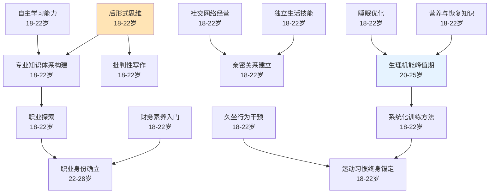

# 大学期（18-22岁）

## 阶段概述

大学期是人生中从青少年向成年过渡的关键阶段，也是后形式思维发展、专业知识体系构建、独立生活能力培养的重要时期。此阶段的核心任务是在学术、职业、人际关系和个人成长等方面建立基础，为未来的职业发展和家庭生活做好准备。

---

## 能力清单

### 认知与心理主线

| 能力 | 说明 | 关键期 | Prompt |
|------|------|--------|--------|
| 后形式思维 | 辩证思考、接受矛盾与模糊性 | 18-22岁 | [post-formal-thinking-01](core/cognitive-psychological/post-formal-thinking-01.md) |
| 专业知识体系构建 | 系统化学习专业知识 | 18-22岁 | [professional-knowledge-01](core/cognitive-psychological/professional-knowledge-01.md) |
| 财务素养入门 | 收支管理、助学贷款、理财基础 | 18-22岁 | [financial-literacy-01](core/cognitive-psychological/financial-literacy-01.md) |
| 自主学习能力 | 从高中结构化到大学自主学习的过渡 | 18-22岁 | [autonomous-learning-01](core/cognitive-psychological/autonomous-learning-01.md) |
| 学术诚信与批判性写作 | 学术规范、引用、批判性思维 | 18-22岁 | [academic-integrity-01](core/cognitive-psychological/academic-integrity-01.md) |
| 职业探索 | 实习、社团、专业方向探索 | 18-22岁 | [career-exploration-01](core/cognitive-psychological/career-exploration-01.md) |
| 亲密关系建立 | 承诺、脆弱性、冲突修复 | 18-22岁 | [intimate-relationship-01](core/cognitive-psychological/intimate-relationship-01.md) |
| 社交网络经营 | 室友关系、社团归属、社交圈建立 | 18-22岁 | [social-network-01](core/cognitive-psychological/social-network-01.md) |
| 独立生活技能 | 时间管理、自我照顾、生活自理 | 18-22岁 | [independent-living-01](core/cognitive-psychological/independent-living-01.md) |

### 身体能力主线

| 能力 | 说明 | 关键期 | Prompt |
|------|------|--------|--------|
| 生理机能峰值期 | 20-25岁身体机能达到峰值 | 20-25岁 | [physical-peak-01](core/physical/physical-peak-01.md) |
| 系统化训练方法入门 | 周期化、渐进超负荷训练 | 18-22岁 | [systematic-training-01](core/physical/systematic-training-01.md) |
| 运动习惯终身锚定 | 建立持久运动习惯的关键期 | 18-22岁 | [exercise-habit-01](core/physical/exercise-habit-01.md) |
| 营养与恢复知识体系 | 运动营养、睡眠优化、恢复策略 | 18-22岁 | [nutrition-recovery-01](core/physical/nutrition-recovery-01.md) |
| 物质使用决策 | 酒精、药物对体能的影响 | 18-22岁 | [substance-decisions-01](core/physical/substance-decisions-01.md) |
| 睡眠优化 | 睡眠质量对学习和运动的影响 | 18-22岁 | [sleep-optimization-01](core/physical/sleep-optimization-01.md) |
| 久坐行为干预 | 长时间学习/编程的健康干预 | 18-22岁 | [sedentary-intervention-01](core/physical/sedentary-intervention-01.md) |

---

## 学习路径图

---

## 理论依据

- Labouvie-Vief后形式思维理论
- Arnett成年初显期（Emerging Adulthood）
- Sternberg爱情三角理论（亲密/激情/承诺）
- Gottman亲密关系冲突修复研究
- 自我决定理论（Ryan & Deci）
- 大学生发展理论（Chickering）
- 生理机能峰值研究（20-25岁）
- 运动习惯维持的纵向追踪研究
- ACSM成年人运动指南
- 睡眠与运动表现研究