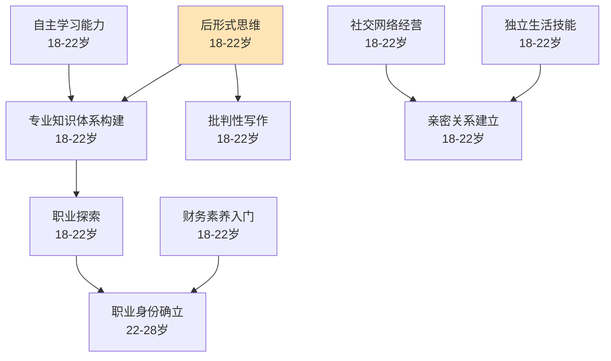

# 大学期（18-22岁）

## 阶段概述

大学期是人生中从青少年向成年过渡的关键阶段，也是后形式思维发展、专业知识体系构建、独立生活能力培养的重要时期。此阶段的核心任务是在学术、职业、人际关系和个人成长等方面建立基础，为未来的职业发展和家庭生活做好准备。

---

## 目录结构

```
大学期/
├── 学术能力/          # 专业知识、研究方法、学术写作
├── 职业探索/          # 实习、职业规划、专业方向
├── 独立生活/          # 时间管理、自我照顾、生活自理
├── 亲密关系/          # 恋爱、友谊、社交网络
├── 财务素养/          # 收支管理、理财基础
└── 兴趣/              # 兴趣探索与深化
```

---

## 能力清单

### 学术能力

| 能力 | 说明 | 关键期 | Prompt |
|------|------|--------|--------|
| 后形式思维 | 辩证思考、接受矛盾与模糊性 | 18-22岁 | [post-formal-thinking-01](学术能力/post-formal-thinking-01.md) |
| 专业知识体系构建 | 系统化学习专业知识 | 18-22岁 | [professional-knowledge-01](学术能力/professional-knowledge-01.md) |
| 自主学习能力 | 从高中结构化到大学自主学习的过渡 | 18-22岁 | [autonomous-learning-01](学术能力/autonomous-learning-01.md) |
| 学术诚信与批判性写作 | 学术规范、引用、批判性思维 | 18-22岁 | [academic-integrity-01](学术能力/academic-integrity-01.md) |

### 职业探索

| 能力 | 说明 | 关键期 | Prompt |
|------|------|--------|--------|
| 职业探索 | 实习、社团、专业方向探索 | 18-22岁 | [career-exploration-01](职业探索/career-exploration-01.md) |

### 独立生活

| 能力 | 说明 | 关键期 | Prompt |
|------|------|--------|--------|
| 独立生活技能 | 时间管理、自我照顾、生活自理 | 18-22岁 | [independent-living-01](独立生活/independent-living-01.md) |

### 亲密关系

| 能力 | 说明 | 关键期 | Prompt |
|------|------|--------|--------|
| 亲密关系建立 | 承诺、脆弱性、冲突修复 | 18-22岁 | [intimate-relationship-01](亲密关系/intimate-relationship-01.md) |
| 社交网络经营 | 室友关系、社团归属、社交圈建立 | 18-22岁 | [social-network-01](亲密关系/social-network-01.md) |

### 财务素养

| 能力 | 说明 | 关键期 | Prompt |
|------|------|--------|--------|
| 财务素养入门 | 收支管理、助学贷款、理财基础 | 18-22岁 | [financial-literacy-01](财务素养/financial-literacy-01.md) |

---

## 学习路径图



---

## 理论依据

- Labouvie-Vief后形式思维理论
- Arnett成年初显期（Emerging Adulthood）
- Sternberg爱情三角理论（亲密/激情/承诺）
- Gottman亲密关系冲突修复研究
- 自我决定理论（Ryan & Deci）
- 大学生发展理论（Chickering）

## 推荐兴趣

以下兴趣领域在本阶段特别适合开始或深入：

| 兴趣 | 阶段定位 | 说明 |
|------|---------|------|
| [英语学习](../../interests/english/intermediate.md) | 黄金期 | 时间充裕、学术需求迫切、出国准备，是全面突破的最佳窗口 |
| [登山](../../interests/mountaineering/beginner.md) | 深入进阶 | 校园社团资源丰富、同伴群体支持，适合从入门走向进阶 |