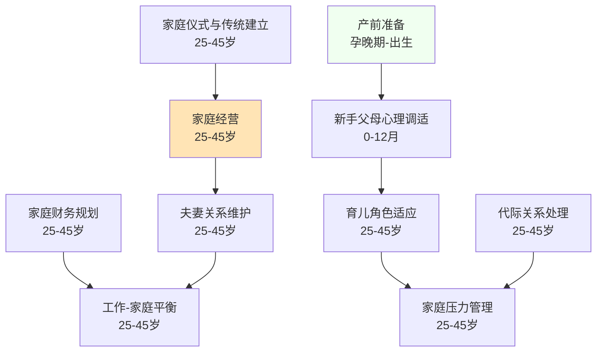

# 家庭期（25-45岁）

## 阶段概述

家庭期是人生中建立和经营家庭的关键阶段，也是育儿角色适应、夫妻关系维护、代际关系处理的重要时期。此阶段的核心任务是在家庭中建立稳定的关系，培养下一代，同时平衡工作与家庭，建立家庭的传统和价值观。

**特别说明**：本阶段包含**育儿指导**目录，为新手父母提供系统化的育儿指导和心理支持。

> **新手爸妈？** 如果你是第一次当爸妈，不知道从哪里开始，先看这里：[新手爸妈快速入口](育儿指导/quick-start.md) — 按场景组织，找到你现在最需要的问题就好。

---

## 目录结构

```
家庭期/
├── 育儿指导/          # 育儿指导（0-14岁）
│   ├── 0-3岁/        # 婴幼儿期育儿指南
│   │   ├── 认知与心理/
│   │   ├── 身体能力/
│   │   └── 兴趣/
│   ├── 3-6岁/        # 学龄前期育儿指南
│   ├── 6-9岁/        # 学龄初期育儿指南
│   ├── 9-12岁/       # 学龄中期育儿指南
│   ├── 12-14岁/      # 青春期前期育儿指南
│   └── 父母自身/     # 照料者心理健康与支持
│       ├── 产前准备/
│       ├── 产后调适/
│       ├── 育儿压力/
│       ├── 自我照顾/
│       └── 关系维护/
├── 婚姻经营/          # 夫妻关系、冲突解决、亲密感维持
├── 家庭管理/          # 家庭财务、代际关系、家庭仪式
├── 健康管理/          # 产后恢复、家庭运动、营养管理
└── 兴趣/              # 兴趣探索与深化
```

---

## 能力清单

### 婚姻经营

| 能力 | 说明 | 关键期 | Prompt |
|------|------|--------|--------|
| 夫妻关系维护 | 婚姻经营、冲突解决、亲密感维持 | 25-45岁 | [marital-maintenance-01](婚姻经营/marital-maintenance-01.md) |
| 亲密关系深化 | 从恋爱到婚姻的关系深化 | 25-45岁 | [relationship-deepening-02](婚姻经营/relationship-deepening-02.md) |

### 家庭管理

| 能力 | 说明 | 关键期 | Prompt |
|------|------|--------|--------|
| 家庭经营 | 亲密关系维护、家庭氛围营造 | 25-45岁 | [family-management-01](家庭管理/family-management-01.md) |
| 育儿角色适应 | 从夫妻到父母的角色转变 | 25-45岁 | [parenting-role-01](家庭管理/parenting-role-01.md) |
| 家庭压力管理 | 育儿压力、经济压力、代际冲突 | 25-45岁 | [family-stress-01](家庭管理/family-stress-01.md) |
| 家庭财务规划 | 家庭预算、教育基金、保险规划 | 25-45岁 | [family-financial-01](家庭管理/family-financial-01.md) |
| 代际关系处理 | 与父母、公婆的关系管理 | 25-45岁 | [intergenerational-01](家庭管理/intergenerational-01.md) |
| 工作-家庭平衡 | 职业发展与家庭责任的平衡 | 25-45岁 | [work-family-balance-01](家庭管理/work-family-balance-01.md) |
| 家庭仪式与传统建立 | 家庭文化的建立与传承 | 25-45岁 | [family-rituals-01](家庭管理/family-rituals-01.md) |

### 健康管理

| 能力 | 说明 | 关键期 | Prompt |
|------|------|--------|--------|
| 产后恢复 | 女性产后身体恢复 | 25-45岁 | [postpartum-recovery-01](健康管理/postpartum-recovery-01.md) |
| 家庭运动习惯传承 | 建立家庭运动文化 | 25-45岁 | [family-exercise-02](健康管理/family-exercise-02.md) |
| 亲子运动活动 | 适合亲子共同参与的运动 | 25-45岁 | [parent-child-exercise-01](健康管理/parent-child-exercise-01.md) |
| 家庭健康饮食管理 | 家庭营养、健康饮食习惯 | 25-45岁 | [family-nutrition-01](健康管理/family-nutrition-01.md) |

### 育儿指导（父母支持主线）

**产前与新生儿期**

| 主题 | 说明 | 适用时期 | Prompt |
|------|------|---------|--------|
| 产前准备与迎接新生儿 | 心理、知识、夫妻关系、物品准备 | 孕晚期-出生 | [产前准备与迎接新生儿](育儿指导/父母自身/产前准备/prenatal-preparation-01.md) |
| 新手父母心理调适 | 产后情绪、睡眠剥夺、角色适应 | 0-12月 | [新手父母心理调适](育儿指导/父母自身/产后调适/parental-wellbeing-01.md) |

**按年龄分阶段育儿指导**

| 阶段 | 年龄 | 核心任务 | 索引 |
|------|------|---------|------|
| 婴幼儿期 | 0-3岁 | 安全依恋、感知运动、语言萌芽 | [0-3岁育儿指南](育儿指导/0-3岁/_index.md) |
| 学龄前期 | 3-6岁 | 执行功能、社会性游戏、入学准备 | [3-6岁育儿指南](育儿指导/3-6岁/_index.md) |
| 学龄初期 | 6-9岁 | 学习习惯、友谊技能、规则意识 | [6-9岁育儿指南](育儿指导/6-9岁/_index.md) |
| 学龄中期 | 9-12岁 | 抽象思维、自我调节、青春期准备 | [9-12岁育儿指南](育儿指导/9-12岁/_index.md) |
| 青春期前期 | 12-14岁 | 身份探索、情绪管理、独立性培养 | [12-14岁育儿指南](育儿指导/12-14岁/_index.md) |

---

## 学习路径图



---

## 理论依据

- Erikson繁衍vs停滞
- 家庭系统理论（Bowen）
- 依恋理论代际传递
- Gottman夫妻关系研究
- 家庭韧性模型
- 家庭健康行为研究
- 亲子运动发展
- 产后运动康复指南
- 家庭健康促进模型