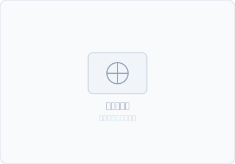

# 洗澡与脐带护理

> **一句话**：新生儿不需要每天洗澡。脐带脱落前只擦浴，保持脐部干燥。

---

## 真实场景

第一次给宝宝洗澡。你提前准备了浴盆、水温计、两片浴巾、洗发水、沐浴露、棉签、酒精、干净的尿布和衣服——摆满了一桌子。水温试了五遍，37.5°C。把宝宝放下去的那一刻——他哇地一声哭了。你手忙脚乱，水溅得到处都是。你老婆在旁边说"他是不是冷"。你不知道是继续洗还是捞出来。

**没关系，每个爸妈第一次都这样。看完这篇，下次你会淡定很多。**

---

## 30 秒判断：什么时候洗、怎么洗？

| 情况 | 怎么做 |
|------|--------|
| 脐带还没脱落 | **只擦浴**，不盆浴。脐部保持干燥 |
| 脐带已脱落，肚脐愈合 | 可以盆浴 |
| 宝宝刚吃完奶 | 等 30-60 分钟再洗，防吐奶 |
| 室温低于 24°C | 不开暖气不洗。室温 26-28°C 最舒适 |

---

## 方法一：擦浴 🧽（脐带脱落前）

| 步骤 | 怎么做 | 关键细节 |
|------|--------|---------|
| ① | 准备：室温 26-28°C，温水 37-38°C（手腕内侧试温） | 提前准备好所有东西，不要中途离开 |
| ② | 宝宝平躺，只露出正在擦的部位 | 其他部位用浴巾盖着保暖 |
| ③ | 顺序：脸→脖子→手臂→胸→背→腿→屁股 | 从上到下，从干净到脏 |
| ④ | 每擦一个部位，用毛巾轻轻拍干 | **不要来回擦**——新生儿皮肤太嫩 |
| ⑤ | 脐部：用棉签蘸 75% 酒精，从脐根部向外螺旋擦 | 每天 1-2 次，直到脱落 |

**频率：** 每周 2-3 次就够了。中间日子用湿毛巾擦脸、脖子、手和屁股。

**为什么不能盆浴：** 脐带泡水会增加感染风险。保持干燥，让它自然脱落（通常 1-3 周）。

---

## 方法二：盆浴 🛁（脐带脱落后）

| 步骤 | 怎么做 | 关键细节 |
|------|--------|---------|
| ① | 水位不超过 5cm，水温 37-38°C | 用手腕内侧试温——不是手指，手腕更敏感 |
| ② | 先放冷水再放热水，搅匀 | **不要边放水边放宝宝** |
| ③ | 脚先入水，慢慢放下身体 | 一只手始终托住头颈和背 |
| ④ | 从上往下洗，洗头最后洗 | 洗发水冲掉时用手遮挡额头，避免流进眼睛 |
| ⑤ | 出水立即用浴巾裹紧，先擦头 | 头部散热最快 |

**频率：** 每周 2-3 次。洗太勤反而会让皮肤干燥。

**一个大人足够吗？** 第一次最好两个人——一个托、一个洗。熟练后一个人完全可以。

---

## 脐带护理三步

| 步骤 | 怎么做 | 频率 |
|------|--------|------|
| ① 清洁 | 棉签蘸 75% 酒精，从脐根部**由内向外**螺旋擦一圈 | 每天 1-2 次，洗澡后必做 |
| ② 干燥 | 用干棉签从内向外再擦一遍，保持干燥 | — |
| ③ 观察 | 正常脱落前会变黑、变干、有少量渗血——都正常 | 每次换尿布 |

**尿布不要盖住脐带。** 把尿布前面折下来，让脐部暴露在空气中。

**脱落时间：** 通常 1-3 周。超过 4 周未脱落建议就医。

---

## 我的实战经验

**第一次洗太紧张了。** 水温调了五遍，把宝宝放下去他哭了，我更慌了。后来发现一个诀窍——**先不要放头**。脚和屁股先入水，让他适应一下，再慢慢放身子。第二次他就没哭了。

**洗头的关键：** 用你的手腕内侧挡在宝宝额头上，水从手指方向往脑后冲——这样水不会流进眼睛。洗发水只需要米粒大小。新生儿头发上的"头皮屑"（摇篮帽）不要抠，洗前用婴儿油轻轻按摩软化。

**冬天洗澡：** 提前开暖风把浴室预暖到 26°C 以上。洗完后在浴室里就把衣服换好（不要抱到冷的房间再穿）。

---

## 需要警惕的信号

- 脐部周围发红、肿胀、有脓性分泌物、触碰就哭 → 可能脐炎，立即就医
- 脐带脱落超过 4 周未脱落
- 洗完澡后宝宝发抖、嘴唇发紫、体温偏低
- 全身皮疹或大面积脱皮

---

## 今天就能做的一件事

检查一下宝宝脐带的状态——干了没？尿布有没有盖住它？如果盖住了，把尿布前面往下折一下，让脐部接触空气。

---

## 推荐资源

### 视频
- 搜索"新生儿洗澡教学"——看真人操作比看文字直观
- 搜索"脐带护理"——注意看棉签从内向外的手法

### 产品
- 婴儿浴盆（带防滑垫和支撑网）
- 水温计（新手期用，熟练后手腕就够）
- 75% 医用酒精 + 医用棉签

---

## 延伸探索

- [粗大动作](../身体能力/gross-motor-01.md) — 洗澡后的抚触按摩有助于运动发育
- [安全依恋](../认知与心理/attachment-01.md) — 洗澡时的肌肤接触是建立依恋的好时机
