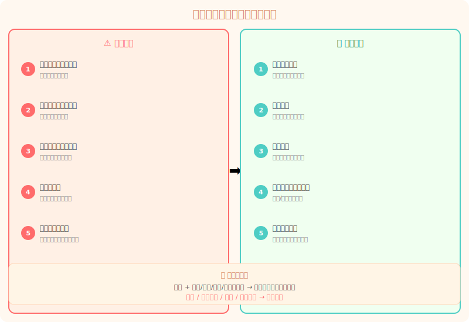
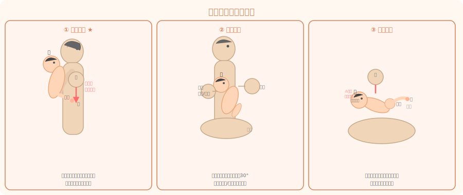
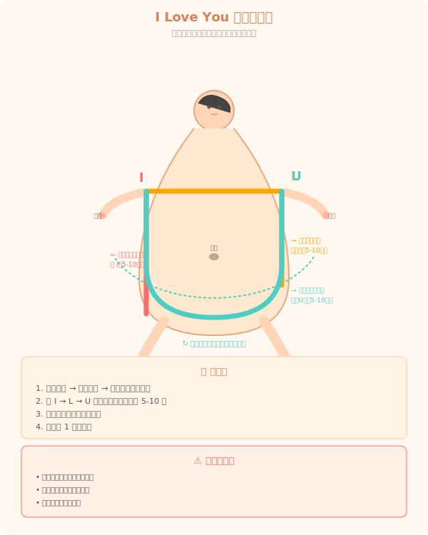
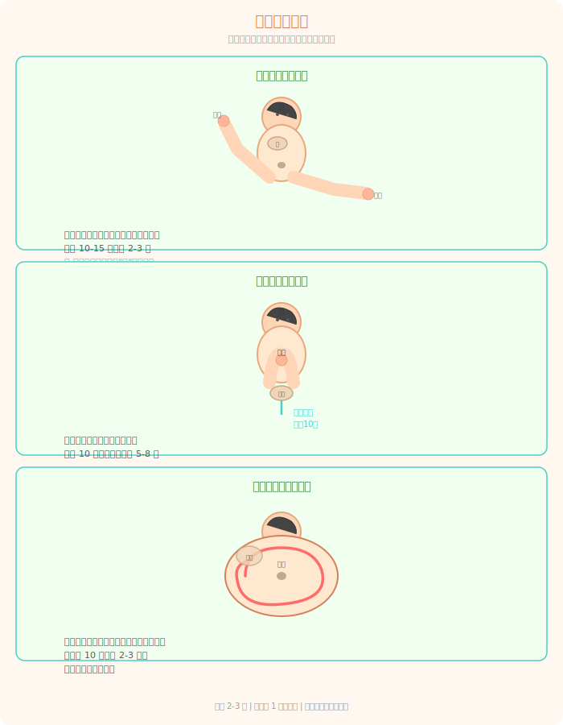

# 新生儿肠胀气应对指南：新手爸妈实操版

> **一句话**：肠胀气不是病，是新生儿消化系统还没长好。**拍嗝 + 按摩 + 排气操**三板斧，基本搞定。

---

> 🎯 **这篇和"理论篇"的区别**：鼓楼的其他内容讲的是"为什么"（发展原理、里程碑），这篇只讲"怎么做"——看完就能上手。如果你还想了解背后的消化系统发育原理，可以看 [口部运动发展](../身体能力/oral-motor-01.md) 和 [感觉统合](../身体能力/sensory-integration-01.md)。

---

## 先看：怎么确认是胀气？

### 胀气的 5 个典型信号

如果你家宝宝同时出现 2 个以上，大概率是胀气了：

1. **频繁哭闹，难以安抚** — 特别是傍晚到夜间（俗称"黄昏闹"）
2. **肚子鼓胀、摸上去硬硬的** — 吃完奶后明显
3. **双腿蜷缩、身体弓起来** — 面部憋红、用力表情，像在使劲但又拉不出
4. **吃奶时烦躁** — 吃几口就松开乳头/奶嘴，哭几下又继续吃
5. **放屁多、声音响、臭** — 放完屁或排完便后明显安静下来

### 快速自查表

| 症状 | 胀气 | 正常 |
|------|------|------|
| 哭闹 | 难以安抚，定时发作 | 抱或喂奶能安抚 |
| 肚子 | 鼓胀、紧绷、硬 | 略鼓但触感软 |
| 吃奶 | 烦躁、吃吃停停 | 节奏稳定、一次吃完 |
| 腿部 | 蜷缩绷直交替 | 自然放松 |
| 放屁后 | 明显好转 | — |

---

## 第一步：喂奶后拍嗝

**黄金法则**：只要喂了奶就拍，不管是母乳还是奶粉。不要等到胀气了才拍。

> **⚠️ 别看完整个教程才动手**：先学会拍嗝这一招，今晚就用上。剩下的明天再看。

### 三种拍嗝姿势

#### ① 竖抱拍嗝（最推荐，适合大部分情况）

**怎么做：**
1. 把宝宝竖抱起来，让他的头靠在你的肩膀上
2. 一只手托住他的臀部
3. 另一只手**空心掌**（手掌弓起来，像捧水一样），由下往上轻轻拍他的背部
4. 拍 5-10 下后，用手掌从上往下轻轻抚摸

**要点：**
- 空心掌！实心掌会拍疼宝宝！
- 拍的位置在背部中间靠下（胃的位置）
- 通常 1-5 分钟内能拍出嗝
- 可以在你肩膀上垫一块口水巾，防止吐奶弄脏衣服

#### ② 坐姿拍嗝（适合 1 个月以上的宝宝）

**怎么做：**
1. 让宝宝坐在你的大腿上，身体微微前倾
2. 一只手从前面托住他的下巴和胸部（注意不要卡脖子）
3. 另一只手空心掌拍背部

**要点：**
- 前倾角度大约 30°
- 这个姿势对胀气严重的宝宝效果更好

#### ③ 趴腿拍嗝（适合吐奶严重的宝宝）

**怎么做：**
1. 坐下，双腿并拢
2. 让宝宝趴在你的大腿上，头侧向一边
3. 一手扶住宝宝，另一只手轻拍背部

**要点：**
- 宝宝的头部略高于脚部
- 这个姿势有重力帮助，拍嗝效果很好
- 注意不要压到宝宝的口鼻

### 拍不出来怎么办？

| 问题 | 解决办法 |
|------|---------|
| 拍了 10 分钟还没嗝 | 换个姿势再试，或者竖抱 15-20 分钟 |
| 宝宝睡着了 | 竖抱 20 分钟再放床 |
| 拍着拍着吐奶了 | 正常，竖抱清理干净即可 |
| 每次都拍不出 | 可能是吃奶时没吸入多少空气（母乳亲喂常见），竖抱一会就行 |

**现实中大部分情况**：拍了好几分钟没动静，一放下床——嗝就自己打出来了。别慌，正常。

---

## 第二步：腹部按摩（I Love You）

**什么时候做**：喂奶后 1 小时，宝宝清醒且心情好的时候。

**怎么做：**

用你的手掌，在宝宝的肚子上按照字母形状轻轻按摩：

1. **"I"** → 从宝宝左侧肋骨下缘，轻轻向下画一条直线到左大腿根部。重复 5-10 遍。
2. **"L"** → 从宝宝左侧肋骨下缘，横着向右画到肚脐上方，再向下画到右大腿根部。形成一个倒写的"L"。重复 5-10 遍。
3. **"U"** → 从宝宝左侧肋骨下缘开始，顺时针画一个倒"U"形过肚脐上方，到右侧肋骨下缘。重复 5-10 遍。

**要点：**
- 手掌搓热再做
- 配合婴儿油或抚触油，减少摩擦
- **顺时针**按摩（顺着肠道蠕动方向）
- 动作轻柔，不要用力按
- 如果宝宝哭闹抗拒，立即停止

**效果**：做完后宝宝通常会开始放屁或排便，肚子会软下来。

---

## 第三步：排气操

**什么时候做**：喂奶后 1 小时，或者宝宝哭闹时作为安抚尝试。

**怎么做：**

### 动作一：蹬自行车

1. 让宝宝平躺
2. 握住宝宝的两条小腿
3. 像蹬自行车一样，交替屈伸宝宝的腿
4. 一组 10-15 次，做 2-3 组

**效果**：促进肠道蠕动，帮助气体排出。做的时候经常能听到"噗噗"的排气声。

### 动作二：双膝压腹

1. 宝宝平躺
2. 握住宝宝的双脚，同时弯曲膝盖
3. 轻轻将双膝压向宝宝的腹部
4. 保持 10 秒，然后放松伸直
5. 重复 5-8 次

**要点：**
- 不要用力压！轻轻挨着肚子就好
- 压下去的时候宝宝可能会放屁，这是好现象

### 动作三：顺时针摸肚

1. 手掌以肚脐为中心
2. 顺时针画圈按摩
3. 由内向外逐渐扩大
4. 每圈 10 秒，做 2-3 分钟

**频率**：每天可以整套做 2-3 遍，不一定要一次做完，可以在换尿布的时候顺便做几个动作。

---

## 日常预防比补救更重要

### 🍼 喂奶时的注意事项

- **母乳亲喂**：确保宝宝含乳姿势正确（上下嘴唇外翻，含住大部分乳晕）
- **奶瓶喂养**：奶瓶倾斜 45°，让奶液充满奶嘴，奶嘴里不要有气泡
- **选择合适奶嘴**：流速太快或太慢都会导致宝宝吞入过多空气
- **按需喂养，不要哭就喂**：宝宝哭不一定是因为饿，可能是胀气不舒服

### 其他有用的小技巧

| 方法 | 怎么做 | 效果 |
|------|--------|------|
| **飞机抱** | 让宝宝趴在你前臂上，头朝手肘、脚朝手 | 利用腹部压力帮助排气 |
| **排气操** | 见上方的步骤 | 主动促进肠道蠕动 |
| **温水澡** | 37-38°C 温水泡澡 5-10 分钟 | 放松腹部肌肉 |
| **顺时针揉肚** | 喂奶后 1 小时顺时针揉 | 顺着肠道方向帮助蠕动 |

### ❌ 不要做的事情

| ❌ | 为什么 |
|---|--------|
| 不要乱用益生菌 | 没有证据表明益生菌对肠胀气有效，不要自行给宝宝喂 |
| 不要喂"排气水/肥仔水" | 部分含有酒精或镇静成分，新生儿禁用 |
| 不要剧烈摇晃宝宝 | 摇晃不能止哭，反而可能导致婴儿摇晃综合征 |
| 不要过度喂养 | 哭≠饿，喂太多反而加重胀气 |

---

## 什么时候该看医生？

虽然肠胀气不是病，但如果出现以下情况，建议咨询儿科医生：

| 信号 | 说明 |
|------|------|
| **发烧** | 体温 ≥38°C（3 个月以下婴儿） |
| **吐奶喷射状** | 剧烈呕吐，不是普通溢奶 |
| **大便异常** | 血便、白便、黑便、严重腹泻 |
| **体重不增或下降** | 生长停滞 |
| **哭声异常** | 尖叫般哭声，难以安抚 |
| **拒绝吃奶** | 连续 6 小时以上不肯吃奶 |
| **精神萎靡** | 嗜睡、反应迟钝 |

> 💡 **简单判断法**：如果宝宝除了哭闹以外，吃奶、体重、大便、精神都正常——大概率只是胀气，不用担心。如果同时出现以上任何一条，送医院。

---

## 今天就能做的事

1. **今晚喂完奶后，试试竖抱拍嗝** — 空心掌，由下往上，拍 5-10 下
2. **换尿布的时候，顺带做 10 下蹬自行车**
3. **观察宝宝是不是"傍晚哭闹 + 蜷腿 + 肚子硬"** — 是的话就是胀气，不是的话也别慌

---

## 推荐资源

### 工具
- 口水巾（多备几条，拍嗝时垫肩膀上）
- 婴儿抚触油（按摩时用）

### 延伸内容
- [口部运动发展](../身体能力/oral-motor-01.md) — 了解新生儿口腔发育与喂养的关系
- [感觉统合](../身体能力/sensory-integration-01.md) — 触觉刺激对新生儿的重要性
- [新手父母心理调适](../父母自身/产后调适/parental-wellbeing-01.md) — 胀气哭闹很磨人，照顾好自己的心态同样重要
