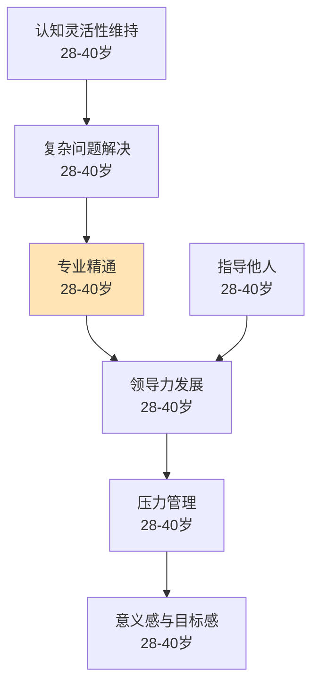

# 职场发展（28-40岁）

## 阶段概述

职场发展是人生中从职业胜任走向专业精通的关键阶段，也是领导力发展、家庭经营、压力管理的重要时期。此阶段的核心任务是在职场中实现专业突破，承担更多责任，同时在个人生活中平衡工作与家庭，建立人生的意义感和目标感。

---

## 目录结构

```
职场发展/
├── 专业精通/          # 从胜任到专家、复杂问题解决
├── 领导力/            # 团队管理、影响力、指导他人
├── 健康管理/          # 压力管理、体能维持、久坐对抗
├── 认知发展/          # 认知灵活性、决策智慧
└── 兴趣/              # 兴趣探索与深化
```

---

## 能力清单

### 专业精通

| 能力 | 说明 | 关键期 | Prompt |
|------|------|--------|--------|
| 专业精通 | 从胜任到专家的专业能力提升 | 28-40岁 | [professional-mastery-01](专业精通/professional-mastery-01.md) |
| 复杂问题解决 | 跨领域整合、系统性思考 | 28-40岁 | [complex-problem-solving-01](专业精通/complex-problem-solving-01.md) |

### 领导力

| 能力 | 说明 | 关键期 | Prompt |
|------|------|--------|--------|
| 领导力发展 | 从个人贡献者到团队领导者 | 28-40岁 | [leadership-development-01](领导力/leadership-development-01.md) |
| 指导他人 | mentoring能力、知识传承 | 28-40岁 | [mentoring-01](领导力/mentoring-01.md) |

### 健康管理

| 能力 | 说明 | 关键期 | Prompt |
|------|------|--------|--------|
| 压力管理 | 职场与家庭双重压力应对 | 28-40岁 | [stress-management-01](健康管理/stress-management-01.md) |
| 体能维持 | 峰值后缓慢下降的应对策略 | 28-40岁 | [fitness-maintenance-01](健康管理/fitness-maintenance-01.md) |
| 久坐对抗 | 办公室工作者的运动处方 | 28-40岁 | [sedentary-counter-02](健康管理/sedentary-counter-02.md) |
| 核心力量与姿势管理 | 预防久坐带来的姿势问题 | 28-40岁 | [core-strength-01](健康管理/core-strength-01.md) |
| 基础代谢率下降应对 | 30岁后每10年约降2-3%的应对 | 28-40岁 | [metabolic-decline-01](健康管理/metabolic-decline-01.md) |

### 认知发展

| 能力 | 说明 | 关键期 | Prompt |
|------|------|--------|--------|
| 认知灵活性维持 | 对抗思维固化、保持学习能力 | 28-40岁 | [cognitive-flexibility-01](认知发展/cognitive-flexibility-01.md) |
| 意义感与目标感 | 人生意义探索、价值观澄清 | 28-40岁 | [meaning-purpose-01](认知发展/meaning-purpose-01.md) |

---

## 学习路径图



---

## 理论依据

- Erikson繁衍vs停滞（25-64）
- Dreyfus技能习得模型（胜任→精通→专家）
- Seligman PERMA幸福模型
- Kahneman系统1/系统2与决策偏差
- 领导力发展：变革型领导理论
- 基础代谢率下降研究
- 久坐行为健康风险（WHO）
- ACSM成年人运动处方
- 运动与心理健康元分析