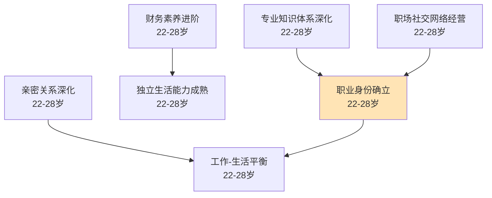

# 职场开始（22-28岁）

## 阶段概述

职场开始是人生中从校园走向社会的关键过渡阶段，也是职业身份确立、财务能力提升、亲密关系深化的重要时期。此阶段的核心任务是在职场中建立专业能力，实现经济独立，同时在个人生活中建立稳定的亲密关系和独立生活能力。

---

## 目录结构

```
职场开始/
├── 职业发展/          # 专业技能、职场适应、职业规划
├── 财务规划/          # 储蓄、投资、税务、财务独立
├── 人际关系/          # 职场社交、导师关系、亲密关系
├── 健康管理/          # 运动习惯、久坐对抗、睡眠优化
└── 兴趣/              # 兴趣探索与深化
```

---

## 能力清单

### 职业发展

| 能力 | 说明 | 关键期 | Prompt |
|------|------|--------|--------|
| 专业知识体系深化 | 从学习到实践的专业能力转化 | 22-28岁 | [professional-deepening-01](职业发展/professional-deepening-01.md) |
| 职业身份确立 | 从学生到职业人的身份转变 | 22-28岁 | [professional-identity-01](职业发展/professional-identity-01.md) |
| 工作-生活平衡 | 初步探索工作与生活的平衡 | 22-28岁 | [work-life-balance-01](职业发展/work-life-balance-01.md) |

### 财务规划

| 能力 | 说明 | 关键期 | Prompt |
|------|------|--------|--------|
| 财务素养进阶 | 储蓄、投资、税务、财务规划 | 22-28岁 | [financial-advanced-01](财务规划/financial-advanced-01.md) |

### 人际关系

| 能力 | 说明 | 关键期 | Prompt |
|------|------|--------|--------|
| 职场社交网络经营 | 职场人际关系、导师关系建立 | 22-28岁 | [professional-network-01](人际关系/professional-network-01.md) |
| 亲密关系深化 | 同居、订婚、婚姻准备 | 22-28岁 | [relationship-deepening-01](人际关系/relationship-deepening-01.md) |

### 健康管理

| 能力 | 说明 | 关键期 | Prompt |
|------|------|--------|--------|
| 系统化训练方法 | 周期化、渐进超负荷训练 | 22-28岁 | [systematic-training-02](健康管理/systematic-training-02.md) |
| 运动习惯巩固 | 从建立到巩固运动习惯 | 22-28岁 | [exercise-habit-consolidation-01](健康管理/exercise-habit-consolidation-01.md) |
| 营养与恢复知识体系 | 运动营养、恢复策略深化 | 22-28岁 | [nutrition-recovery-02](健康管理/nutrition-recovery-02.md) |
| 久坐对抗 | 办公室工作者的运动处方 | 22-28岁 | [sedentary-counter-01](健康管理/sedentary-counter-01.md) |
| 睡眠优化 | 职场人士的睡眠管理 | 22-28岁 | [sleep-optimization-02](健康管理/sleep-optimization-02.md) |

---

## 学习路径图



---

## 理论依据

- Erikson亲密vs孤独（18-40）
- Super职业发展理论
- Savickas生涯建构理论
- 财务行为学研究
- ACSM成年人运动指南
- 久坐行为健康风险（WHO）
- 职场健康促进研究